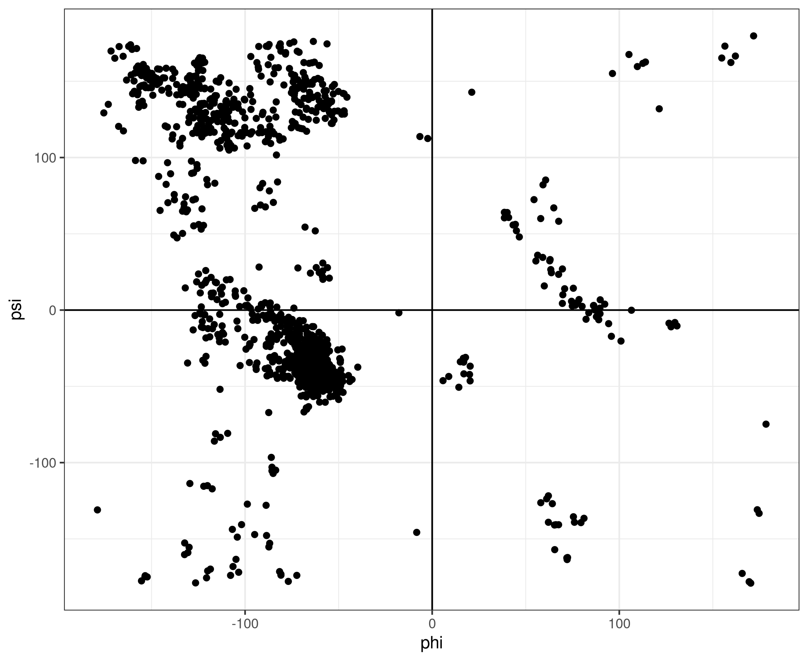

# protein

[](https://crates.io/crates/protein)
[](https://crates.io/crates/protein)
[](https://crates.io/crates/protein)
[](https://docs.rs/protein)

Protein structural Biology in Rust.

**NOTE: This crate is in early development and the API has not yet been stabilized, so do not use this crate in production. If you have any suggestions, please don't hesitate to open an issue or make a PR!**

## Components


| **crate**            | Links                                                                                                                                                                                                                                                                                                                    |
| -------------------- | ------------------------------------------------------------------------------------------------------------------------------------------------------------------------------------------------------------------------------------------------------------------------------------------------------------------------ |
| **protein**          | [](https://crates.io/crates/protein)[](https://crates.io/crates/protein)[](https://docs.rs/protein)                                                       |
| **protein-core**     | [](https://crates.io/crates/protein-core)[](https://crates.io/crates/protein-core)[](https://docs.rs/protein-core)                         |
| **protein-get**      | [](https://crates.io/crates/protein-get)[](https://crates.io/crates/protein-get)[](https://docs.rs/protein-get)                               |
| **protein-io**       | [](https://crates.io/crates/protein-io)[](https://crates.io/crates/protein-io)[](https://docs.rs/protein-io)                                     |
| **protein-analysis** | [](https://crates.io/crates/protein-analysis)[](https://crates.io/crates/protein-analysis)[](https://docs.rs/protein-analysis) |


## Example

Let's read a protein structure from a PDB file and draw a Ramachandran plot!


```rust
use csv::Writer; // the crate `csv` is required if you want to output csv
use protein::{
    io::pdb::Parser, // the PDB parser that parses PDB file into a `Structure`
    analysis::ModelAnalysis // `Structure` alone only stores data.
                              // Functions for analysing the `Structure` are provided by separate traits
 };
use std::fs;

fn main() {
    let pdbfile = get_pdb("4f7i").unwrap();
    let structure = Parser::parse(&pdbfile).unwrap();
    let (phis, psis) = structure.models[0].ramachandran(); 
    // the `.ramachandran()` function is provided by the `ModelAnalysis` trait
    // this produces vectors of phi and psi angles in radians

    // the code below is used to output csv, which is optional
    let mut wtr = Writer::from_path("examples/ramachandran.csv").unwrap();
    wtr.write_record(&["phi", "psi"]).unwrap();
    for (&phi, &psi) in phis.iter().zip(psis.iter()) {
        wtr.write_record(&[phi.to_string(), psi.to_string()])
            .unwrap()
    }
    wtr.flush().unwrap();
}

```

This will produce a csv file containing two columns representing phi and psi angles. Then we can read the csv file in R and plot it (unfortunately I am not familiar with any graphing libraries in Rust):



You can directly run the above example using `cargo run`:

```bash
cargo run --example ramachandran
```


<!-- ## IO Formats

PDB is the oldest, and probably the most well-known file format in the field of structural biology. However, [as claimed by RSCB](https://pdb101.rcsb.org/learn/guide-to-understanding-pdb-data/beginner%E2%80%99s-guide-to-pdb-structures-and-the-pdbx-mmcif-format), there are some limitations of the PDB file format and it is expected to be replaced the the PDBx/mmCIF format. Therefore, while this crate provides methods to manipulate PDB files, the PDBx/mmCIF format is our first-class citizen. -->

