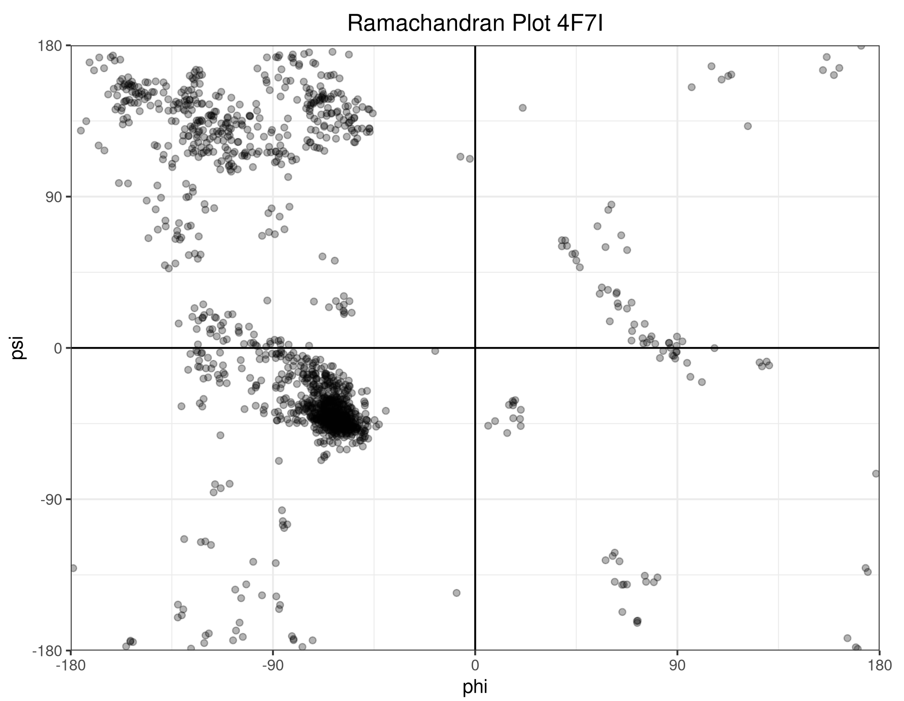

# protein

Structural Biology in Rust

## Example

Let's read a protein structure from a PDB file and draw a Ramachandran plot!


```rust
use csv::Writer; // the crate `csv` is required if you want to output csv
use protein::{
    io::pdb::Parser, // the PDB parser that parses PDB file into a `Structure`
    analysis::ModelAnalysis // `Structure` alone only stores data.
                              // Functions for analysing the `Structure` are provided by separate traits
 };
use std::fs;

fn main() {
    let data = fs::read("assets/4f7i.pdb").unwrap();
    let (_, structure) = Parser::parse(&data).unwrap();
    let (phis, psis) = structure.models[0].ramachandran(); 
    // the `.ramachandran()` function is provided by the `ModelAnalysis` trait

    let mut wtr = Writer::from_path("examples/ramachandran.csv").unwrap();
    wtr.write_record(&["phi", "psi"]).unwrap();
    for (&phi, &psi) in phis.iter().zip(psis.iter()) {
        wtr.write_record(&[phi.to_string(), psi.to_string()])
            .unwrap()
    }
    wtr.flush().unwrap();
}

```

This will produce a csv file containing two columns representing phi and psi angles. Then we can read the csv file in R and plot it (unfortunately I am not of any graphing libraries in Rust):



You can directly run the above example using `cargo run`:

```bash
cargo run --example ramachandran
```


<!-- ## IO Formats

PDB is the oldest, and probably the most well-known file format in the field of structural biology. However, [as claimed by RSCB](https://pdb101.rcsb.org/learn/guide-to-understanding-pdb-data/beginner%E2%80%99s-guide-to-pdb-structures-and-the-pdbx-mmcif-format), there are some limitations of the PDB file format and it is expected to be replaced the the PDBx/mmCIF format. Therefore, while this crate provides methods to manipulate PDB files, the PDBx/mmCIF format is our first-class citizen. -->

